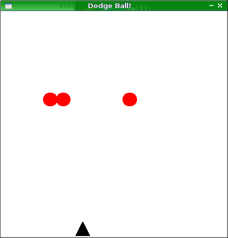

# Dodge

# Update for Nim 1.0

Congrats Nim!

To be honest I haven't kept up with the language much since 2016. I think in
2018 I tried a dev build of Nim for fun, but it failed to compile this. It was
not a simple error, either... ultimately the fix was simple, though. I just had
to import the `random` module, because the `random` function that used to be
built-in was now shepherded off.

I tried building again today, and a new error! It doesn't like the type `expr`
in my old syntax template. I replaced this with `untyped` following a 10-second
search and look at an example in the manual, no idea if this is actually right.
But it builds now. I ran into a runtime error I suspect is due to a negative
number in the final random(), anyway should be fixed...

The compiler generally seems more helpful now. It's got a number of useful
warnings, for instance, about how `random` is deprecated, and a couple things
are unused. The crashes have line numbers in stack traces. I'm annoyed that
source updating was required (not unexpected was rebuilding sdl2 with nimble)
but the experience was pretty straightforward and even better than I last
remember it a year ago.

But that Python code (which the nim code copied as close as possible at the
expense of readability etc) is over a decade old. Still runs.

Basically I've settled on Common Lisp being my preferred language to spend my
limited side project energy on. I want that longevity (even longer than Python,
plus no Foundation to wreck stuff) but also just the language features. Lisp
can be as low level as Nim, or super high level, it's cross-cutting.

I'd still prefer to get back into Nim over, say, C++, especially in a game
context. But ideally I'd just want to do more Lisp. It's a fun and rewarding
language to master.

Anyway just a bit of a bittersweet happy 1.0. We'll see if I have to update
this again just to keep this basic demo building in the future.

----

A long time ago, sometime in 2006 or 2007, I was learning how to make games
with Python and PyGame. One of my first attempts was cloning a calculator
game I played a lot on my TI-89, simply called Dodge. You can see the result
(as well as the not too great code) in dodgeball.py assuming you have
Python 2.7 and PyGame installed. To run the Nim version, you need to install
Nim, Nimble, Nim's SDL2 package through Nimble, and then just run the Makefile.

# Thoughts on the project

Nim is a relatively new language that's been on my radar for a while (back
when it was still Nimrod) and I've been wanting to learn it for almost as
long. I think it has good potential for game programming given its
relatively nice FFI to C, its simple (and optional) garbage collector,
and its none-too-complicated (if still somewhat surprising in places)
type system.

So I decided to port this early game over. Despite its simplicity, it covers
things like:

* Controlling frame rate
* Handling key press inputs (what to do on key down?)
* Handling keyboard state input (is this key pressed right now?)
* Rendering primitive geometry instead of pngs

The PyGame version even goes into making a menu and rendering text. I
decided to call it quits and not do that with the Nim version,
but it shouldn't be too hard to add.

There was really one major thing about this project that made it a lot harder
than I anticipated, and that was SDL2. PyGame is built around SDL1, which
I now understand has a quite different mental model for how to do things.
You can see this most clearly in how esoteric it now is to create a
surface (now a "Texture") that contains a simple geometric shape like
a circle or triangle while the non-filled parts of that shape are transparent.
In PyGame (and SDL1 in general) this is a really simple thing to do,
which makes prototyping really nice because you just make a surface with
some shapes or text blobs or whatever temporary thing on it while you
develop and you come back and do sprite work later. Now it is much more
complicated, and slugging through SDL2's documentation to understand this
new mental model was easily the hardest part.

The second difficulty, though relatively minor in comparison, was with Nim's
type system. In short, I don't have a great mental model for when an integer
will get converted to an "int literal" that then gets implicitly converted into
things like cints or uints. I suspect this is really only a pain point when
you work so close to the C API, and if I were going to try and build a PyGame
equivalent for Nim on top of SDL2 you bet all that would be hidden. It's just
very strange to me that accessing the constant individual elements in something
like `[1 2]` just doesn't give you the same type behavior as referencing a
constant symbol to that number directly (that is, not in a container). As a
result there are quite a few int conversions in this code, and I guess as a
matter of a fairly strong static type system in the end there is also more
float-to-int conversion than I'd like to deal with.

Other than that, it was a pretty fun project. Nim is a neat language, though
I'd hesitate it to call it very Python-esque now that I've done something
with it. Its "OOP model" is nothing the same, its type system has many
differences beyond the obvious static (albeit a lot less ceremony than other
languages!) vs. dynamic thing, and there's just a lot more syntax and choice.
I've barely touched on Nim's total features but I still feel like there's a lot
of syntax. But again I enjoyed my time, and Nim has now solidified itself as
something I should definitely reach for when a project demands C or C++. Or
even the other potential replacement languages I want to dive into like
Rust or OCaml. If the Nim team ever gets a killer REPL going, that could be
a huge advantage.

Probably my favorite feature came out of Nim's loose syntax rules, and that was
being able to write simple functions in an OOP-y way because Nim sees no
difference between `x(foo, bar)` and `foo.x(bar)`.

# License

All code files are released in the public domain. If you need a WTFPL for
some reason let me know.

# Note for watchers/people using this to learn

https://hookrace.net/blog/writing-a-2d-platform-game-in-nim-with-sdl2/ is a much better tutorial. :)
